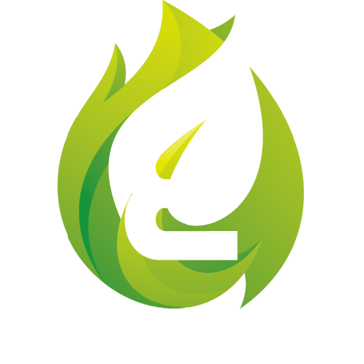

<!-- PROJECT LOGO -->
<br />
<p align="center">
  <a href="https://github.com/nicklamyeeman/RADAGAST">
    
  </a>

  <h3 align="center">RADAGAST</h3>

  <p align="center">
    Discord Bot for Epitech La Réunion
    <br />
    <a href="https://github.com/nicklamyeeman/RADAGAST/wiki"><strong>Explore the docs »</strong></a>
    <br />
    <br />
    <a href="https://github.com/nicklamyeeman/RADAGAST/issues">Report Bug</a>
    ·
    <a href="https://github.com/nicklamyeeman/RADAGAST/issues">Request Feature</a>
  </p>
</p>


<!-- TABLE OF CONTENTS -->
## Table of Contents

* [About the Project](#about-the-project)
  * [Built With](#built-with)
* [Getting Started](#getting-started)
  * [Installation](#installation)
  * [Discord Bot Development](#discord-bot-development)
    * [Add Event](#add-event)
    * [Add Command](#add-command)
* [Roadmap](#roadmap)
* [Contributing](#contributing)
* [Contact](#contact)
* [Acknowledgements](#acknowledgements)


<!-- ABOUT THE PROJECT -->
## About The Project

This project is a Discord Bot for Epitech La Réunion to manage students easily.


### Built With

* [NodeJS](https://nodejs.org/)
* [DiscordJS](https://discord.js.org/)


<!-- GETTING STARTED -->
## Getting Started

To get a local copy up and running follow these simple steps.

### Installation

1. Clone the repo
```sh
git clone https://github.com/nicklamyeeman/RADAGAST.git
```
2. Use npm to build and run
```sh
npm install
npm run dev
```


### Discord Bot Development

#### Add Event

The project allows you to add events easily by adding a js file in the `public/events/` directory.

__Example :__
```js
module.exports = {
  name: 'interactionCreate',
  execute(interaction) {
    if (interaction.isChatInputCommand()) {
      const command = interaction.client.commands.get(interaction.commandName);  
      if (!command) return;
      try {
        command.chatInputExecute(interaction);
      } catch (error) {
        console.error(error);
        interaction.reply({ content: `Error!`, ephemeral: true });
      }
    }
  },
};
```

#### Add Command

The project allows you to add commands easily by adding a js file in the `public/commands/` directory.

__Example :__
```js
  const { SlashCommandBuilder } = require("discord.js");

  module.exports = {
    data: new SlashCommandBuilder()
      .setName('ping')
      .setDescription('Replies with Pong!'),
    async chatInputExecute(interaction) {
      return interaction.reply({content: `Pong!`, ephemeral: false});
    }
  };
```


<!-- ROADMAP -->
## Roadmap

See the [open issues](https://github.com/nicklamyeeman/RADAGAST/issues) for a list of proposed features (and known issues).


<!-- CONTRIBUTING -->
## Contributing

Contributions are what make the open source community such an amazing place to be learn, inspire, and create. Any contributions you make are **greatly appreciated**.

1. Fork the Project
2. Create your Feature Branch (`git checkout -b feature/AmazingFeature`)
3. Commit your Changes (`git commit -m 'Add some AmazingFeature'`)
4. Push to the Branch (`git push origin feature/AmazingFeature`)
5. Open a Pull Request


<!-- CONTACT -->
## Contact

Nick LAM YEE MAN - [@nickauteen](https://twitter.com/nickauteen) - nick.lam-yee-man@epitech.eu

Project Link: [https://github.com/nicklamyeeman/RADAGAST](https://github.com/nicklamyeeman/RADAGAST)


<!-- ACKNOWLEDGEMENTS -->
## Acknowledgements

* [Best-README Template](https://github.com/othneildrew/Best-README-Template)


<!-- MARKDOWN LINKS & IMAGES -->
<!-- https://www.markdownguide.org/basic-syntax/#reference-style-links -->
[contributors-shield]: https://img.shields.io/github/contributors/nicklamyeeman/repo.svg?style=flat-square
[contributors-url]: https://github.com/nicklamyeeman/repo/graphs/contributors
[forks-shield]: https://img.shields.io/github/forks/nicklamyeeman/repo.svg?style=flat-square
[forks-url]: https://github.com/nicklamyeeman/repo/network/members
[stars-shield]: https://img.shields.io/github/stars/nicklamyeeman/repo.svg?style=flat-square
[stars-url]: https://github.com/nicklamyeeman/repo/stargazers
[issues-shield]: https://img.shields.io/github/issues/nicklamyeeman/repo.svg?style=flat-square
[issues-url]: https://github.com/nicklamyeeman/repo/issues
[license-shield]: https://img.shields.io/github/license/nicklamyeeman/repo.svg?style=flat-square
[license-url]: https://github.com/nicklamyeeman/cpm-cppm/blob/main/LICENSE
[linkedin-shield]: https://img.shields.io/badge/-LinkedIn-black.svg?style=flat-square&logo=linkedin&colorB=555
[linkedin-url]: https://linkedin.com/in/nicklamyeeman
[product-screenshot]: images/screenshot.png